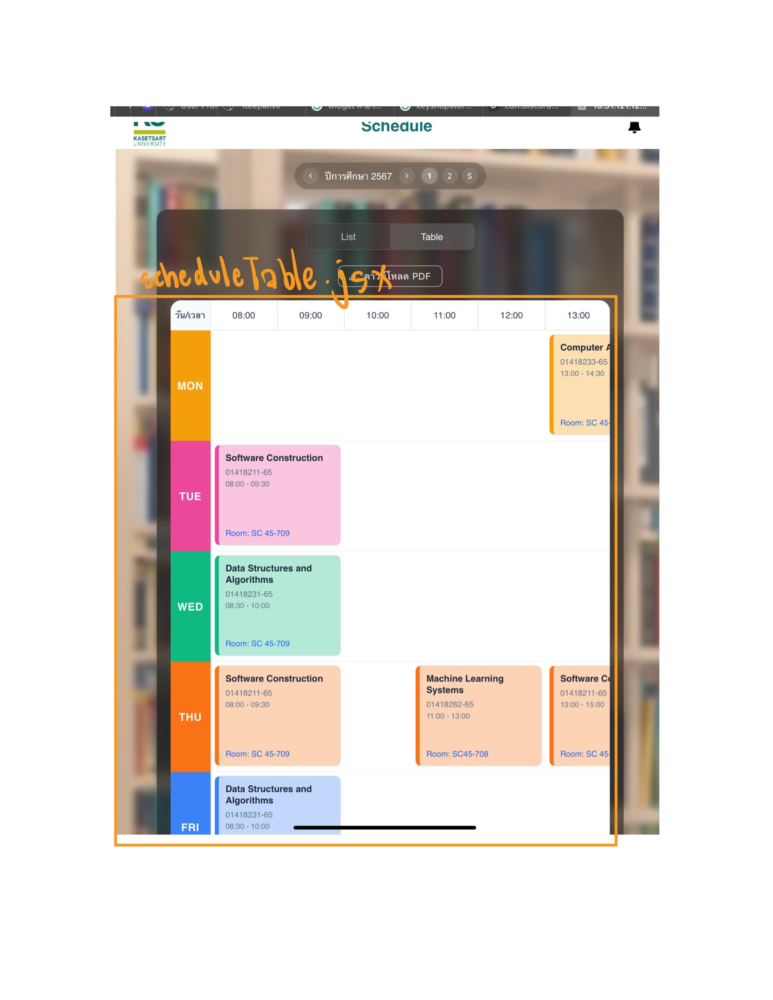
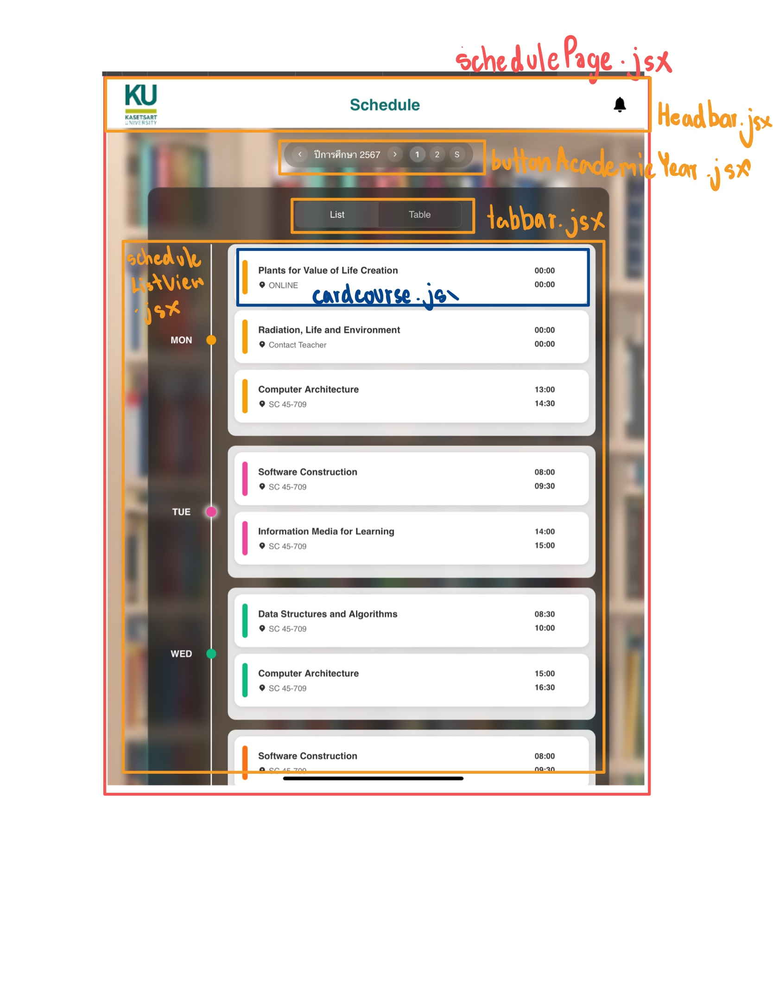

# Schedule Web Application Documentation

## 📖 Overview

This is a **React-based schedule application** built for managing and viewing **Kasetsart University** course schedules. It features both **list** and **table** views, advanced filtering by **academic year** and **semester**, and supports **PDF export** for convenience and offline access.

---

## 🧭 Table of Contents
- [🚀 Installation](#installation)
- [🗂️ Project Structure](#project-structure)
- [✨ Features](#features)
- [🧩 Component Documentation](#component-documentation)
- [🎨 Customization Guide](#customization-guide)
- [🔗 API Integration](#api-integration)
- [⚙️ Environment Variables](#️environment-variables)

---

## 🚀 Installation

### 1. Clone the repository:
```bash
git clone https://github.com/your-username/schedule.git
cd schedule
```

### 2. Install dependencies:
```bash
cd frontend
npm install
```

### 3. Start the development server:
```bash
npm run dev
```

---

## 🗂️ Project Structure

```
schedule/
├── frontend/
│   ├── public/                      # Static assets
│   ├── src/
│   │   ├── assets/                  # Images and resources
│   │   ├── components/              # Reusable UI components
│   │   ├── screens/                 # Page views
│   │   ├── services/                # API logic and hooks
│   │   ├── styles/                  # CSS and style modules
│   │   ├── utils/                   # Constants and utility functions
│   │   ├── App.jsx
│   │   ├── index.css
│   │   └── main.jsx
│   ├── package.json
│   └── vite.config.js
└── .gitignore
```

---

## ✨ Features

### 🔀 Dual View Options
- 📱 Mobile-friendly **List View**
- 📊 Traditional **Table View**
- Seamless switching via tab bar

### 🎯 Filtering
- Filter by **academic year** and **semester** (1, 2, or Summer)
- Built-in filtering within the table view

### 🖨️ PDF Export
- Export schedules as downloadable PDFs for offline access

### 📱 Responsive Design
- Fully adaptive UI for **desktop**, **tablet**, and **mobile**

---

## 🧩 Component Documentation

### 📄 `schedulePage.jsx`
- Main container component
- Manages academic year, semester, and view state
- Handles loading/error states

### 🔌 `scheduleApi.jsx`
- Central API logic and hooks
  - `fetchScheduleData()` - fetches raw data
  - `filterScheduleByTerm()` - filters data by term/year
  - `useScheduleData()` - custom hook for fetching and transforming data

### 📋 `scheduleListView.jsx`
- Renders a vertical list of courses grouped by day
- Highlights the current day
- Uses `cardCourse.jsx` components for each course

### 📆 `scheduleTable.jsx`
- Renders horizontal grid-based timetable
- Shows course blocks based on time/day
- Includes PDF export capability

### 🔢 `buttonAcademicYear.jsx`
- Year and semester selection UI
- Includes increment/decrement controls and toggle switches

### 🧭 `tabbar.jsx`
- Simple tab UI for toggling views
- Highlights active selection

### 📝 `cardCourse.jsx`
- Displays course name, code, time, and location
- Color-coded by day for clarity

### 🧱 `headbar.jsx`
- Fixed app header
- Displays logo, app title, and optional icons

---

## 🔗 API Integration

This application uses a **RESTful API** to fetch schedule data from KU's system:

- **API Endpoint**: `https://my-ku-phase2-uat.my-dev.co/myku/openapi/v1`
- **Authentication**: Bearer token required
- **Scope**: Course data fetched per student

### 🔄 Data Processing Flow
1. Raw schedule data fetched via API
2. Data filtered by academic year and semester
3. Data is transformed into displayable structure
4. Grouped by day
5. Rendered into list or table view

---

## 🎨 Customization Guide

### 🎨 Change Theme Colors
Modify colors per day in `scheduleConstants.js`:
```js
export const dayColors = {
  MON: "#f59e0b",  // Amber
  TUE: "#ec4899",  // Pink
  // Update more colors as needed
};
```

### 🕐 Adjust Time Slots
Edit the `TIME_SLOTS` array in `scheduleTable.jsx`:
```js
const TIME_SLOTS = Array.from({ length: 14 }, (_, i) => ({
  start: `${String(i + 8).padStart(2, "0")}:00`,
  end: `${String(i + 9).padStart(2, "0")}:00`,
}));
```

### 🔧 Change API Configuration
Update `scheduleApi.jsx` with:
```js
const API_URL = 'https://my-ku-phase2-uat.my-dev.co/myku/openapi/v1';
const TOKEN = 'your-auth-token';
const STUDENT_CODE = 'student-id';
```
> ⚠️ Avoid hardcoding sensitive values. Use `.env` instead.

---

## ⚙️ Environment Variables

Create a `.env` file inside the `frontend/` directory:

```env
VITE_API_URL=your_api_url
VITE_API_TOKEN=your_api_token
```

Use `import.meta.env.VITE_API_URL` and `import.meta.env.VITE_API_TOKEN` to access these values in your code.

---

## 🧱 Schedule Page Structure

The following images show the overall structure of the Schedule Page and which components are responsible for each section:

### 📊 Table View Structure (`scheduleTable.jsx`)


### 📋 List View Structure (`scheduleListView.jsx` with `cardCourse.jsx`)

